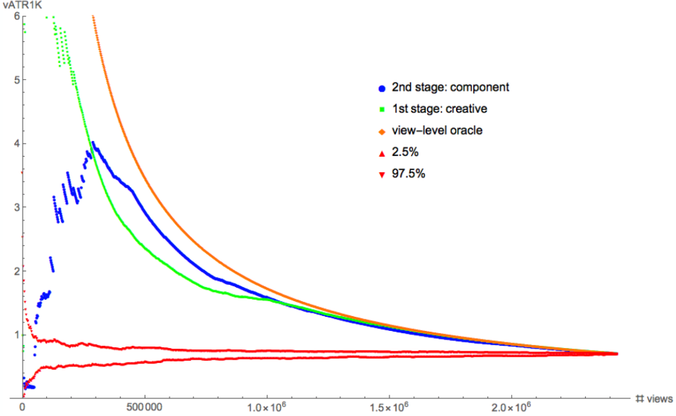

# Synthetic Lift Measurements with Performance Curves

A simple example that shows a straightforward lift measurement can be
done by comparing the performance of a campaign to random targeters. The
measurement is already expressed graphically in th curves above. There is
a geometrical viewpoint to using Performance Curves, but you can also
derive a single measure of goodness - KPI at average rank - that can
be used for numerical comparisons. This README is going to talk only
about the curves geometrically. A future section will discuss how to
compute KPI at average rank.

There are a couple of things to note about how the measurement is
defined:

1. We will be looking at the performance of the campaign in-toto, not just
its AI/ML sub-components. Pacers and bidders also affect how campaign's
perform. But to be clear, if there is something that changes or modifies 
the score of your ad-buying decisions, Performance Curves can help you 
detect when it is sick, under-performing, or your best star. We will
not be talking about this data pipeline stage debugging aspect here.

2. We will be comparing the campaign's performance not just to average
random performance, but to the ensemble of 97.5% of random targeters.
This subtle change is enormously important from the point of view of
satisfying your client expectations. Let me explain why. Comparing
yourself to average random performance means that if you run your
campaign against a random baseline many times, on average, you are x
better. Do you see what is wrong with this operationally? I have seen
it many times. The correct comparison is to the 97.5% percentile or
whatever percentile you want to make sure that your campaign beats
the random baseline the first time, the 2nd time. You pay for this
convenience by demanding more from your models. But isn't that the
point of innovation?

## The curves

Each curve represents a synthetic campaign. This conceptual sleight
of hand is achieved by asserting that sorting according to an
evaluators score is equivalent to running the campaign the way they
would like to run it. It puts what they think is cream first.

You may not like this vague metaphorical assertion at this point,
but in the end it will not matter because you will see that ranking
the data by each evaluator is the sensible way to understand not
just the final outcome but how it was reached.

And here we point out one outstanding feature of Performance Curves -
all comparisons are done on the same data. It is the purest
apples to apples comparison one can come up with.